## Introduction

This is the first article in the "Career" series of urban data groups. The theme of this series is the career development of migrant workers. We will start from the existing recruitment data and use scientific data processing methods to present the current situation to readers. The occupational income growth curves of different occupations in different cities are also combined with the recent hot spots of public opinion to estimate the occupational substitution that AI may produce.

As the first tweet in the series, I will start with the data used in this series of research and the grouping of "occupations". I hope that after readers understand these basic information and methods, they will be more specific about the follow-up occupational salary and AI replacement rate. The data list has a more accurate understanding.

## Recruitment data of the same age as the Internet in China

If you want to ask, among all kinds of Internet data, what type of data is easy to obtain, has a very large amount of information, and has a relatively long look-back time? My answer is - recruitment data.

Go back in time to more than 20 years ago. At that time, most ordinary families did not have their own computers, let alone the Internet, and what was the most attractive online behavior? Not "surfing the web" or "chatting in a chat room". On September 13, 2000 , an article in "Science and Technology Daily" mentioned:

"With the rapid development of our country's economy , the Internet is gradually accepted by the public. According to survey statistics , among the current Internet users , those who use the Internet for the purpose of job hunting account for half of the Internet population."

On October 9, 2000, an article in "Internet Weekly" "Where to find a job in the future?" The article “Comparison of Recruitment Websites” cites a survey by CNNIC in July 2000. Among the information people obtain online, recruitment information accounts for 26.11%.

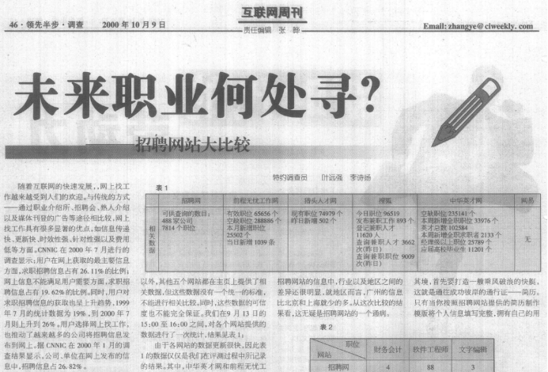

In 1997 , ChinaHR and Zhaopin.com were established;
In 1999 , 51job was established.
In 2005 , 58.com , a job-seeking website for fresh graduates (yingjiesheng), was established.
In the mobile Internet era after 2010 , various recruitment websites and apps have sprung up like mushrooms after a spring rain. Liepin, Boss Zhipin, Lagou... expand the dimension of recruitment data again.

From the high-salary offers coveted by elite school students to domestic service and short-term odd jobs for blue-collar workers, the recruitment data has accumulated not only the story of generations of workers, but also the epitome of the Chinese economy over the past two decades.

Recruitment data, which has appeared and grown together with China's first generation of Internet users since the beginning of the millennium, is a piece of data that is almost the same age as the Chinese Internet.

## Recruitment Data: Representativeness Problem and Simpson's Paradox

Hiring data is also very difficult data to work with . Only through simple processing, it is difficult to present consistent, representative and valuable information.

The representativeness problem has always been a big problem for recruitment data. What kind of companies recruit online, and what kind of companies choose to recruit from other channels? All along, Internet companies, foreign companies, etc., use recruitment websites much more frequently than state-owned companies and manufacturing companies. This makes the total recruitment volume, total resume delivery volume, and average salary indicators obtained through recruitment data summary have a not small bias from the real national average. The recruitment situation of different recruitment websites also varies greatly.

For example, the following picture is a screenshot of the hot jobs of BOSS Direct Recruitment:

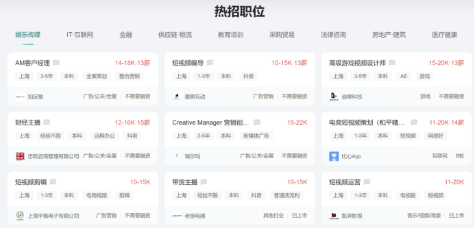

The following picture is a screenshot of the hot search positions for Shanghai recruitment from 58 same cities:

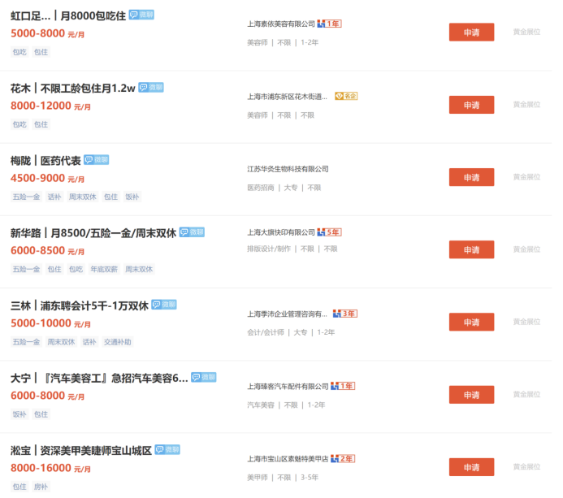

As you can see, the types and directions of recruitment information on the two websites are completely different. When we only use one or several recruitment websites, we inevitably miss a lot, and we cannot output effective conclusions.

In addition, the classification of recruitment data is extremely difficult, which also increases its use threshold. When we use various big data, we often need to match this data with the data of the National Bureau of Statistics according to the appropriate classification standards to get similar caliber data, which is convenient for us to verify the validity of the data.

But for recruitment data, although we have collected 500 million recruitment data and 1.2 billion recruitment vacancies from multiple recruitment website sources through data partners in the past eight years, if we just summarize these recruitment positions, whether it is divided by company, industry or region, it is very difficult to compare with official statistical data.

Why can't massive data get effective conclusions?

First, the number of acquisitions, sources, and company numbers of these data over the years have great differences. As can be seen from the following figure, in 2019, the year with the highest recruitment number, the total number of recruitment vacancies for all recruitment advertisements nationwide was 340 million, but in 2022 it dropped to 34 million, a full ten times difference.

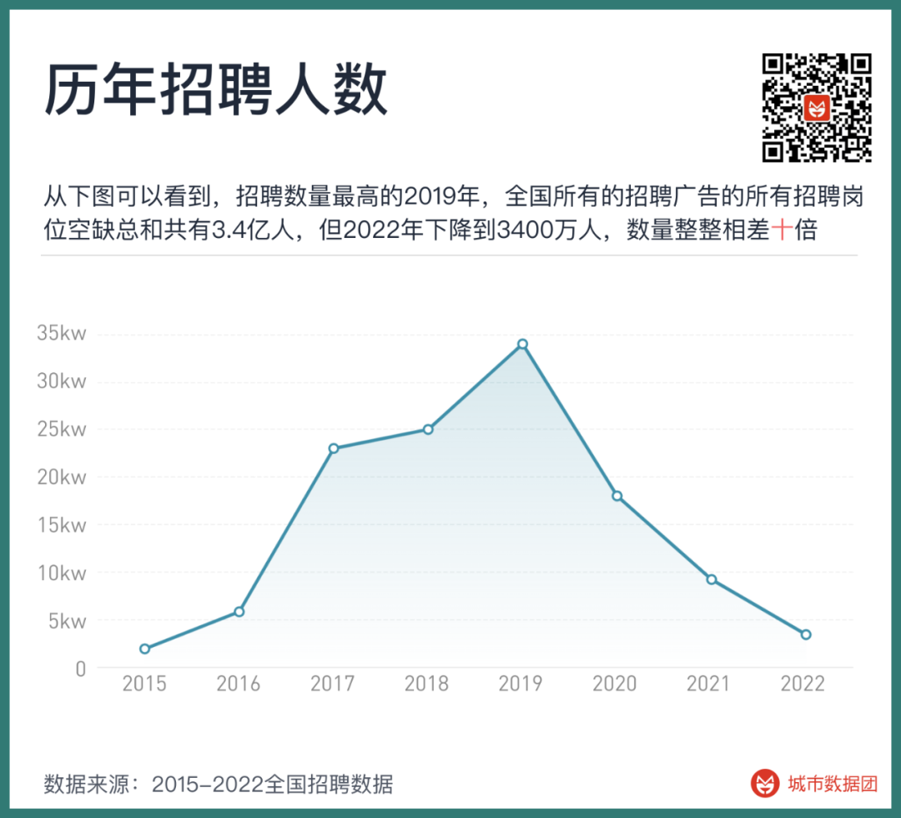

But the change in the number of recruitments on recruitment websites cannot be completely corresponded to the demand for labor by enterprises. In a booming economy, employees turn faster, there are more businesses, and companies have better expectations for the future. Even the repeated adjustments of the same recruitment information will cause the company's recruitment number to fluctuate more than the real labor demand.

Secondly, the salary of recruitment data is also a mixed variable. The following figure shows the average annual salary from 2015 to 2022. It can be seen that the year with the lowest average recruitment salary is 2017, about 4360 yuan/month. From 2015 to 2017, China experienced a continuous decline in recruitment salaries for two years, and then it rose again.

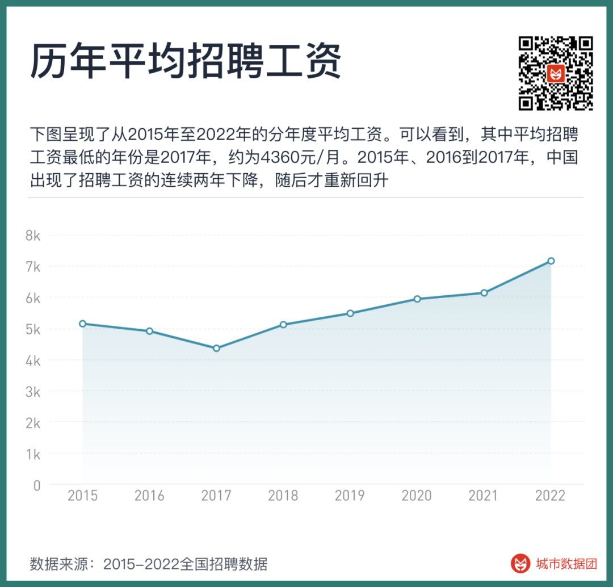

But did the recruitment salary really fall from 2015 to 2017? Not so.

The first reason for the decline in recruitment salaries is the change in the proportion of social recruitment and fresh graduate recruitment in the recruitment structure. When the website data of the proportion of fresh graduate recruitment increases, the average salary decreases; when the data volume of social recruitment positions with many years of experience increases, the average salary will rise again.

The second reason is the sinking of recruitment websites to second- and third-tier cities, and the penetration of previously less recruited worker groups—for example, blue-collar workers, domestic services and other types of work, in recent years, they have increasingly relied on online recruitment. And the wages of this part of the work are much lower than those of programmers who have mainly recruited through the Internet before, thereby lowering the overall average wage.

The famous Simpson's paradox tells us a result: even if the averages of the two groups are rising, the sum of the averages may decrease. In the following example, when calculated separately, the male admission rate of University A and University B is higher than that of females, but the female with a lower admission rate is more in the group with a higher admission rate, resulting in a lower male admission rate after the summary.

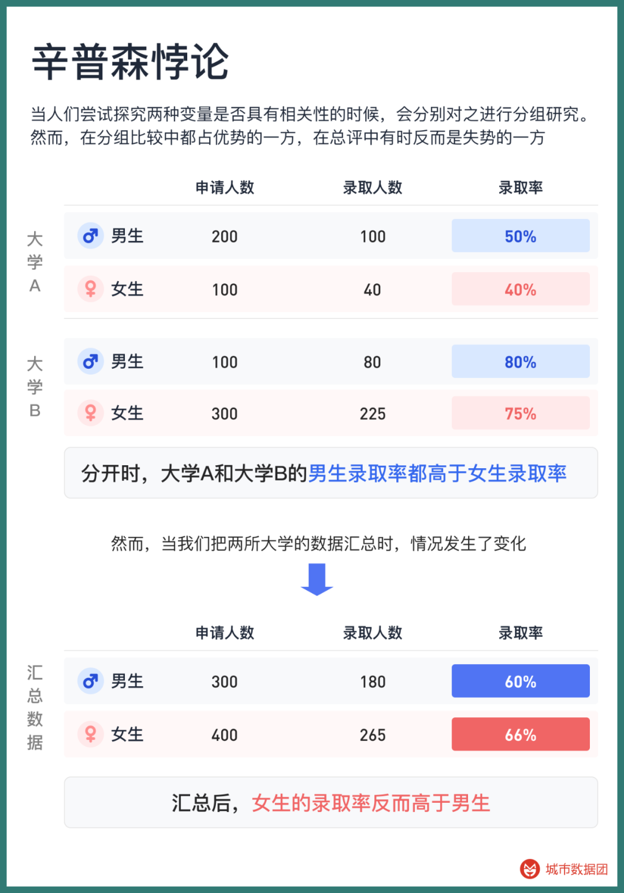

Some recruitment websites use their own data to regularly publish salary reports, which are also limited by their website data structure. There are also large differences with the standard industry and occupational structure of the National Bureau of Statistics, making it difficult to compare with other recruitment websites and difficult to combine with statistical data to get a comparable caliber.

## Cracking the Simpson's Paradox: How to Group Occupations in a Standard Way

To classify and map the occupations, we first used the GPT4 model of ChatGPT to generate a typical recruitment advertisement.

As you can see, the function of the position itself, as well as the required education and experience, have a great relationship with the salary of this position. Education and experience are relatively easy to separate from the text, that is, "computer-related majors, undergraduate, more than 3 years". But how do we classify this occupation? How do we separate a Python engineer from other types of positions in order to control the inherent ability requirements of this position?

The first way is to use the job classification of the recruitment website itself. The following three screenshots are from BOSS Direct Recruitment, Zhaopin Recruitment, and 58 City, and their categories all include "Human Resources/Administration". As you can see, there are many overlaps and differences in their occupational classifications. The "salary performance" of BOSS Direct Recruitment is divided into "salary benefits" and "performance appraisal" in Zhaopin Recruitment. In 58 City, not only are salary and performance combined into one category, but "employee relations" is also included.

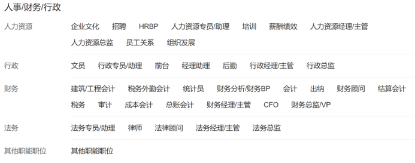

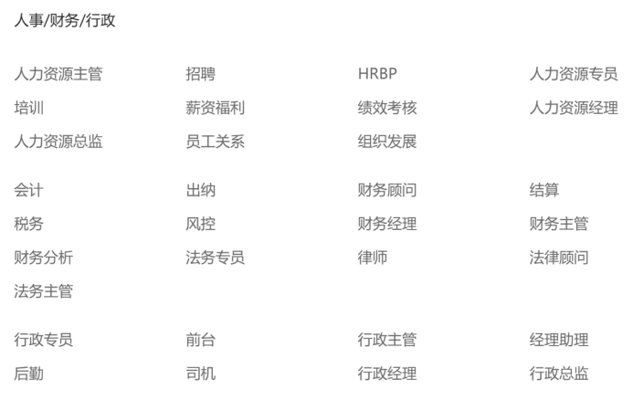

When we click into a certain category of occupation, a certain position often "holds multiple positions", or there is only a difference in qualifications, and there is no difference in function. The division of different recruitment data makes the use of recruitment data more difficult.

In order to make a comparison of the same caliber, we naturally need a more authoritative and standard occupational division. We used the "China Occupation Encyclopedia" as the basis for occupational division.

The "China Occupation Encyclopedia" is the occupational classification used by the National Bureau of Statistics, the Ministry of Human Resources and Social Security, etc. when counting various occupations. The China Population Census, Population Dynamic Sampling Survey, etc. all use the "China Occupation Encyclopedia" as the basis for the occupational division of each surveyed worker. The latest 2022 version of the "China Occupation Encyclopedia" includes 8 major categories, 79 medium categories, 449 small categories, and 1639 detailed categories (occupations), which is the most complete and authoritative division of Chinese occupations.

For example, if we want to find the classification of "programmer" from it, we can find it through the following hierarchical table:

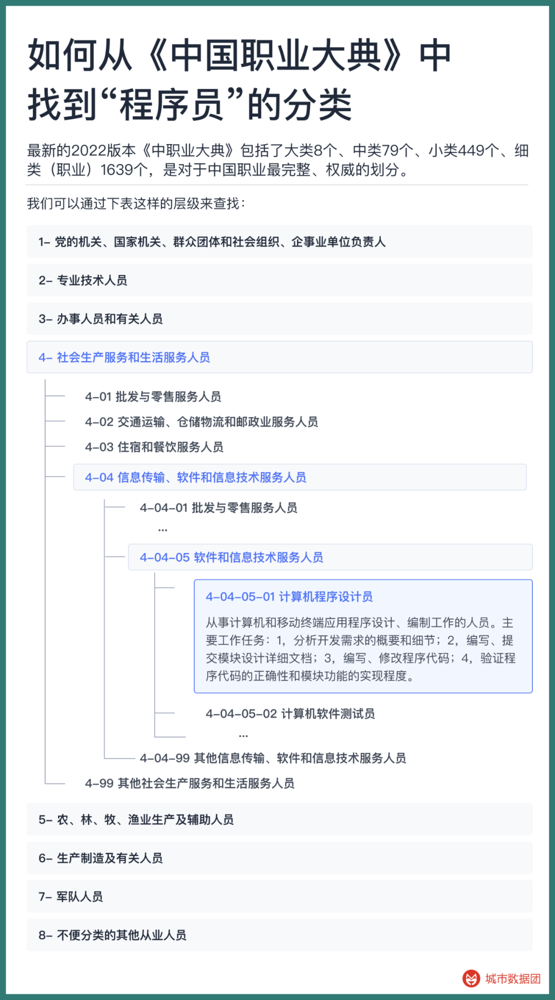

This kind of occupational division ensures that the intersection between occupations is minimal and the union is maximal to the greatest extent. We will try to map all recruitment data to these 1639 occupations.

But how to divide and map? Just the position of "computer program designer", the job title on the recruitment website may include a series of keywords such as JAVA, Python, Ruby, Golang, Node.js, C++... This is a relatively familiar occupation for the author, and we may be able to traverse this category of occupations through keyword mapping. But for some relatively unfamiliar occupations, such as "course consultant with a monthly income of over 10,000 and a large space for promotion", can you accurately classify him into the category of "salesperson" in the standard occupational code?

Therefore, we used a method of text learning. First, let the computer learn the specific work of each occupation, and then match it through the job description of each position, as shown in the figure below:

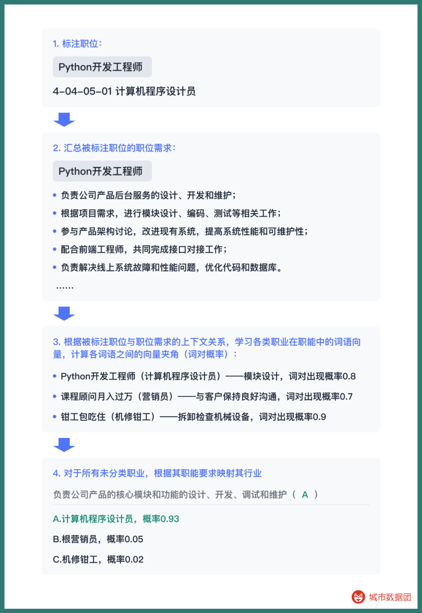

Through preliminary annotation, the specific work of each occupation is combined with the name of the occupation to calculate the high-frequency word pairs of the occupation-function. Starting from the job function of the recruitment advertisement description, use Bayesian probability to calculate which specific occupation may correspond to, and calculate the specific classification of each occupation like a cloze.

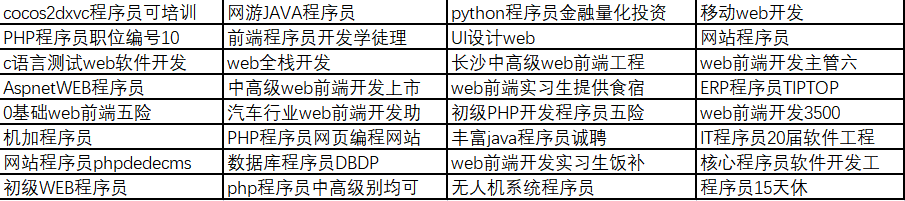

This method has a very high accuracy. The following is a group of examples we classified into "computer program designers". As you can see, even if there is no keyword "programmer" in the title of the position, we may not be able to traverse various program-related keywords, but we can accurately classify this position through its job function.

Using this method, we have allocated the recruitment data of 500 million and 1.2 billion recruitment vacancies obtained from various recruitment websites, as many as 18 million occupations, to more than 1,500 standard occupations, forming a standard occupation database of various cities across the country from 2015 to 2022.

## Initial Glimpse of Occupational Passwords, Recruitment Data "Mine" Built
With the standard occupational database, we can control the recruitment time, place, experience requirements, education requirements, and job type of each position. When we use these data again, there will be no bias problems similar to Simpson's paradox.

For example, based on this, when we calculate the recruitment salary for each year again, we can get the following figure:

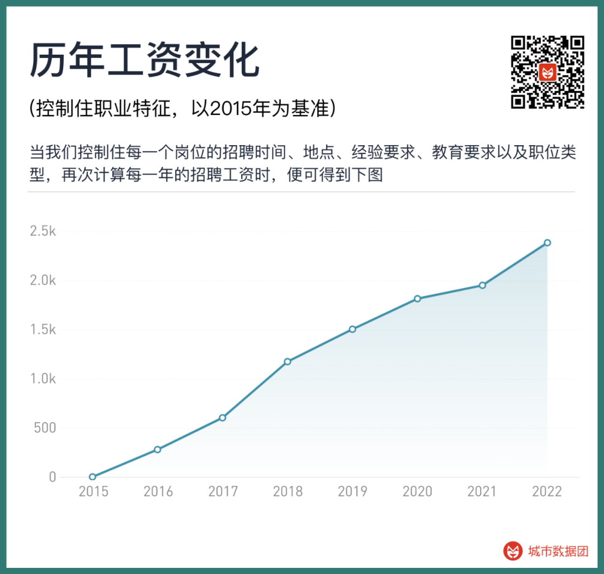

At this time, we can see a steadily rising wage growth curve, without a sudden drop. The same recruitment time, place, experience requirements, education requirements, and a job, the recruitment salary in 2022 is 2385 yuan higher than in 2015.

This also means that this "gold mine" containing billions of recruitment data is no longer a chaotic open-pit wild mine, but has been built into a stable and controllable industrial-grade mine.

What needs to be done next is to mine and smelt various valuable gold information from it.

## Preview of the next part

In this post, we figured out how to map the positions on job advertisements to more standard occupational classifications, so as to avoid data misjudgment caused by incorrect classifications. This just completes the construction of the "recruitment data mine".

In the second post of the series, we will enter the main part of mining (data analysis) to see how the income of practitioners in various cities and occupational categories changes with time and experience in their careers Cumulative improvement and change. For readers who want to do it themselves, we will also simultaneously update the query module of all research-related data in this series (including the AI replacement rate that everyone cares about.） The calculation of the AI replacement rate for different occupations will be introduced in detail in the third post.

