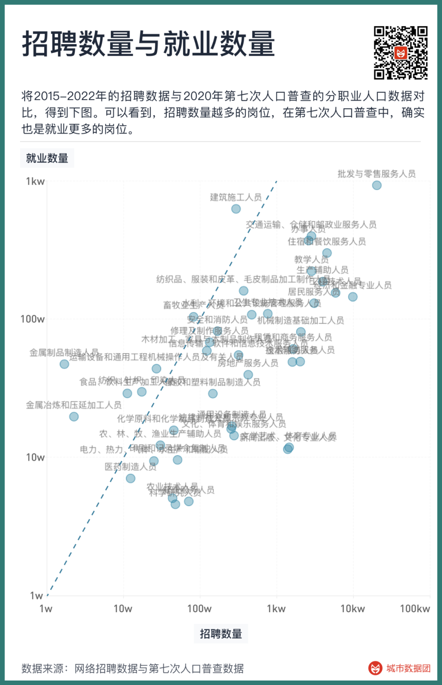
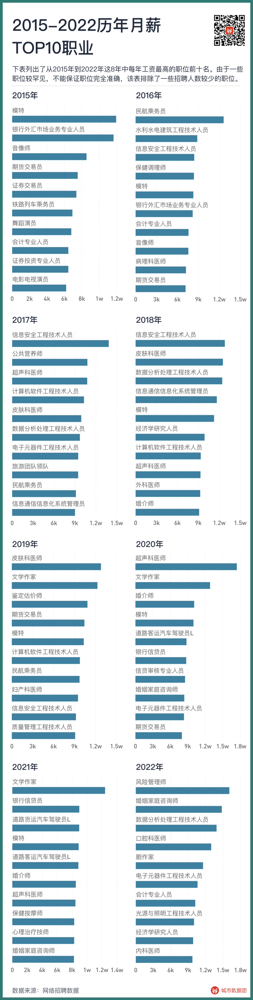
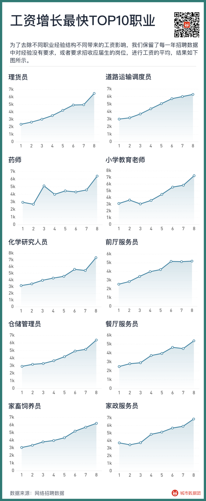
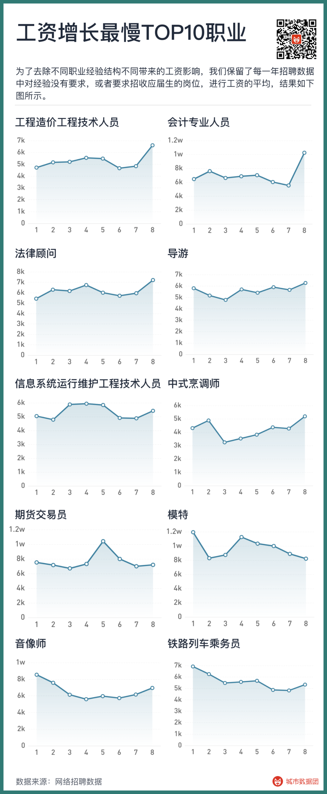
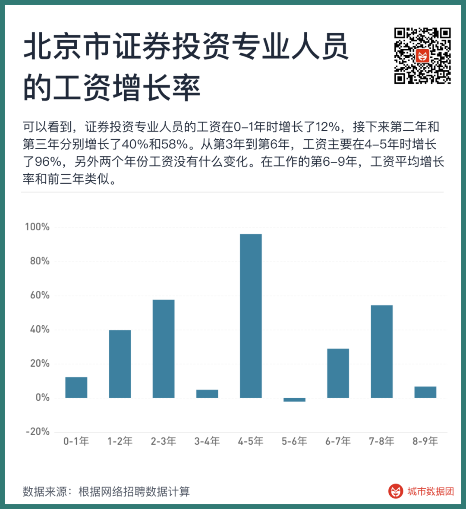
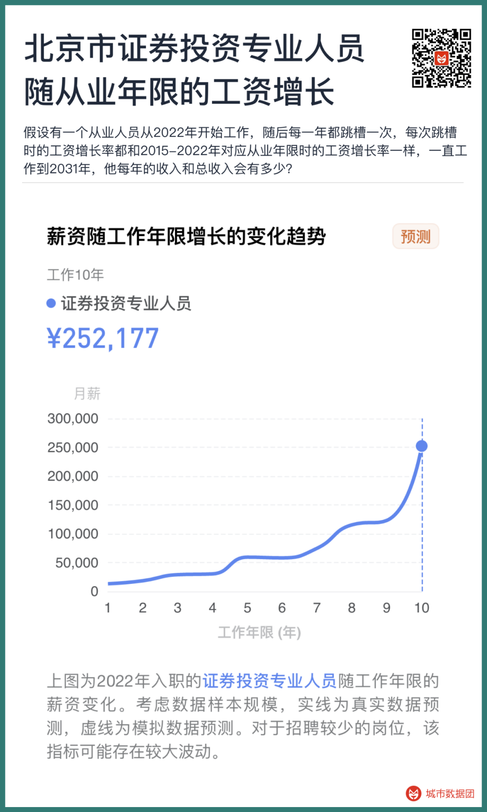
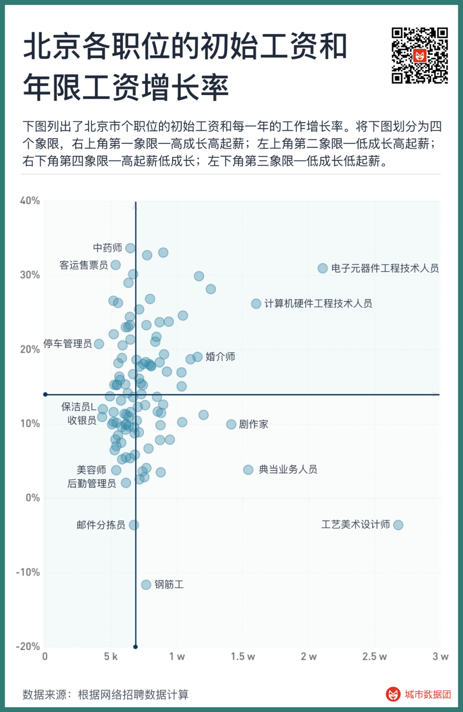
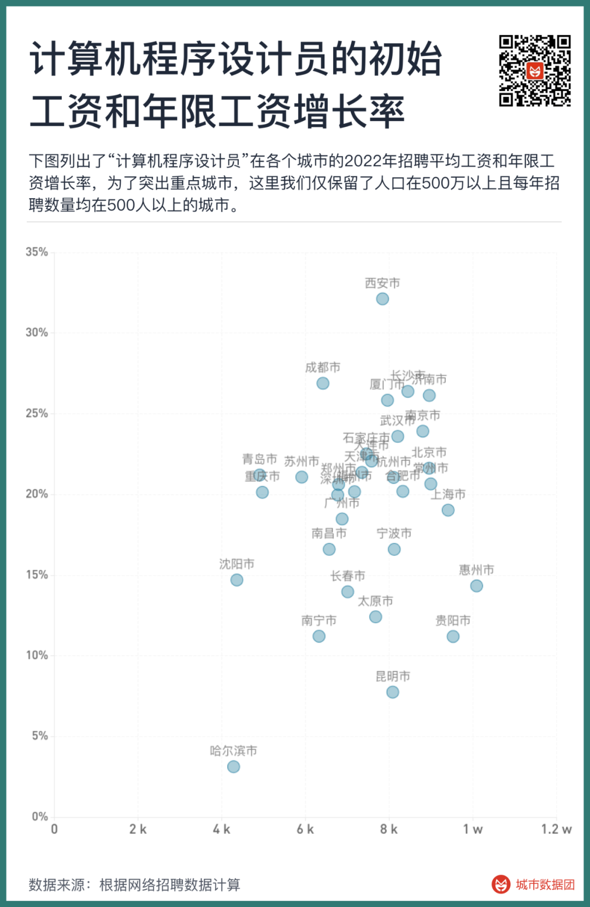

In the previous article, we mapped 500 million recruitment data points from 2015 to 2022 to the standard job codes in China.

How should we interpret this vast amount of recruitment data? What phenomena can we observe from this data? In this article, we will explore these questions.
## Relation Between Recruitment Data and Actual Employment Data

Firstly, it's important to clarify that not all jobs can find corresponding recruitment data. For example, in the first major category, "Officials of Party Organs, State Organs, Mass Organizations, Social Organizations, and Leaders of Enterprises and Institutions," most jobs do not recruit online. In "Clerical and Related Workers," many positions are also only recruited through civil service or institutional exams, and hence, they do not appear on recruitment websites. Similar situations occur with police, military, and agricultural, forestry, fishing and husbandry related positions.

Therefore, the results shown by the recruitment data are closer to what we often refer to as the "working-class" category. In this category, there are 357 occupations that can find corresponding recruitment data.

So, to what extent can recruitment data relate to actual employment data?

By comparing recruitment data from 2015-2022 with the occupational population data from the seventh national census in 2020, we get the following graph.

As can be seen, positions with more recruitment are indeed the ones with more employment in the seventh census. The employment numbers for certain positions are higher than recruitment numbers, especially for metal product manufacturing workers, construction workers, etc. On the other hand, for some jobs such as news publishing, cultural arts and sports professionals, recruitment numbers are higher than employment numbers, reflecting different job tendencies for online recruitment. Blue-collar jobs rarely recruit on major recruitment websites, while white-collar jobs do the opposite.

Overall, the correlation between the recruitment data and the actual number of people employed in the industry reaches 0.57. Analyzing recruitment data will be a great tool for us to analyze the Chinese labor market.

## Highest Paying Professions

The content that people care about the most is probably the wage level for each job. Which jobs have the highest salaries? Many people might guess, influenced by mass media, that the top ranking ones should be computer-related or business-related professions.

But the reality is more complex than we imagined.

The following table lists the top ten highest paying jobs each year from 2015 to 2022. Some positions are quite rare, so we cannot guarantee absolute accuracy. Hence, this table excludes positions with fewer recruitments.

Surprisingly, many unexpected jobs appear in the table.

In the past eight years, the position that has topped the salary chart the most is — models. Models have appeared six times in the top ten list, missing out only in 2017 and 2022, and their ranking has been stable around the 4th to 5th place from 2018 to 2021.

The next three positions that frequently lead the salary charts are sonographers, futures traders, and information security engineers, who all made the list four times in eight years. Business and computer science each claim a position here. Sonographers emerge as the most stable in medical professions.

Then there are nine jobs that made the list three times in eight years. They are electronic component engineering technicians, computer software engineering technicians, data analysis and processing engineering technicians, dermatologists, accountants, writers, flight attendants, marriage consultants, and marital and family counselors.

Among these nine jobs, there are three computer-related ones, one in business, and one in medical. These three major fields have taken up five positions. Programmers finally made the list.

Here we can see that the classification of standard jobs is highly specific. The term "programmer" seems a bit too broad in definition.

The "information security engineering technician" that ranks highest in the previous text, making the list four times in eight years, can be considered a type of programmer.

The "data analysis and processing engineering technician" who is proficient in Python, R, and SQL could possibly be considered half a programmer.

Even for those primarily engaged in coding, in the Chinese standard occupational classification system, they are divided into two types.

One is the "computer software engineering technician" that made the list three times in eight years, coded as 2-02-10-03 in the Chinese standard occupation, meaning "engineering technicians who engage in computer software research, requirements analysis, design, testing, maintenance, and management".

Another type is called "computer programmer," coded as 4-04-05-01 in the Chinese standard occupation, meaning "personnel who engage in computer and mobile terminal application program design and coding". This type of job does not rank high in salary according to recruitment data, generally falling after the twentieth place.

Apart from computer science, business, and medicine, of the remaining four jobs that made the list three times, besides flight attendants, who are traditionally perceived as high paying, marriage consultants? Writers? They seem rather puzzling.

Job recruitment for marriage consultants is indeed scarce, and people might not be familiar with it. But the job with the most mapping to "writer" is not unfamiliar to people. It's — new media content creators. "Writers," mainly refer to new media content creation in text, and the "playwright" ranked 5th in 2022 belongs to short video script content creation. The past four years have been the highest earning years for content creators. From text to short video, one after another, salaries naturally rise with the tide.

Some readers might wonder, although a WeChat public account editor is also a content creator, how can it be considered a writer? To clear up this issue, let's refer back to the previous article and revisit our basis for classifying jobs — not by what the job is called, but by what the job requires employees to do (which is precisely the scientific nature of standard occupational classification). Thus, the top priority of new media content creators' recruitment requirements is to create high-quality, creative, and potentially viral articles that attract massive readership. And the standard occupational classification closest to this requirement is precisely "writer."

## Gift of the Times: Occupations with the Fastest Wage Growth Over the Years

Salary level is only a static number. Many people, especially fresh graduates or prospective college students who haven't made their career choices yet, are genuinely concerned about how salaries change over time.

So, which occupations have seen the fastest average wage growth from 2015 to 2022?

To eliminate the impact of different job experience structures on wages, we retained the data for positions that either had no experience requirements or sought fresh graduates each year, and averaged their salaries. The results are shown in the following graph.

It can be seen that the fastest-growing positions are generally those that originally had lower salaries and relatively low requirements for education and skills. Among them, positions such as warehouse clerks, road transport dispatchers, and storage administrators are all logistics-related. Front desk attendants, restaurant servers, and domestic helpers are typical service roles, and their wages have risen rapidly in recent years, from 2000-3000 yuan in 2015 to over 6000 yuan at present.

Pharmacists, primary school teachers, and chemical researchers are among the few professional and technical positions. The wage growth of these three positions all give a sense of "turning over a new leaf."

Even though Chemistry is considered one of the "four pits of biochemistry and materials," and Pharmacy is relatively unpopular among medical colleges, their wage growth is quite rapid according to the data.

Interestingly, the case of "primary school teachers" stands out. After the "double reduction" policy, the recruitment of primary school teachers decreased by nearly 80% from 2021 to 2022, but their wages dramatically increased from 5800 yuan to 7200 yuan. Because, in 2022, most of the recruitment for "primary school teachers" did not come from primary schools or similar educational institutions, but from the demand of middle-class families who lost a large number of institutional training options for "private home primary school teachers."

So, what are the occupations with the slowest wage growth?

The positions with the slowest wage growth are more concentrated in high-paying jobs. High-paying jobs such as models, futures traders, and accounting professionals that appeared earlier all show up here. In recent years, the salaries of models and futures traders have declined, while the wages of accounting professionals have remained almost unchanged for many years, with only a significant increase in 2022.

In the accommodation and catering industry, although the wages of front desk attendants and restaurant servers have significantly increased, the wages of "Chinese cooks," i.e., Chinese chefs, have remained almost unchanged. Tour guides' wages have not risen in these years, especially since the outbreak of the pandemic in 2020, their wages have hardly grown. In addition, the wage growth of cost engineers, legal consultants, information system operation and maintenance engineers, and audio-visual technicians has also been slow.

## Personal Accumulation: Wage Growth with Years of Service

Wage growth includes two dimensions over time.

The first time dimension involves different cohorts (people joining in different years) doing the same job, but due to changes in supply-demand relations and skill structures, they earn different wages in different years, representing market changes over time. This was discussed in the previous section.

The second time dimension pertains to a single cohort (people joining in the same year), where after several years on the job, due to skill growth, rich experience, team expansion, although their job category remains similar, their wages have significantly increased. This represents the return of experience.

For example, when we say some jobs get "better with age," and others are only for the "young," we're making the most distinct distinction between these two types of jobs.

To best distinguish these two temporal differences, in the previous section "wage growth over time," we used data that all required no experience. In this section, we will use annual recruitment data divided by years of service. The wage growth rate with experience is calculated based on the difference between experience and wages across years.

For example, for position A, in 2018, the average salary for recruitment positions requiring 0 years of experience on the market was 5000 yuan. In 2019, the average salary for recruitment positions requiring 1 year of experience in position A on the market was 6000 yuan.
It's not hard to see that the group with 0 years of experience in 2018 and the group with 1 year of experience in 2019 come from the same cohort. Therefore, 6000 ÷ 5000 = 120% is the wage growth multiple brought about by the experience of 0 to 1 year from 2018 to 2019 for the same cohort.
We calculate the wage growth multiples brought about by the experience of 0 to 1 year for all years, including 2015 to 2016, 2016 to 2017...2020 to 2021, 2021 to 2022, these 7 0 to 1 years, and then average them according to the number of recruits, to get the wage growth multiples brought about by the experience of 0 to 1 year in the past 8 years for position A.

Using the same method, we calculate the wage growth multiples from 1 to 2 years, 2 to 3 years...8 to 9 years. We multiply all the wage growth multiples for each year to get the wage growth multiple for this position from 0 years of experience to 9 years of experience over a total of 10 years of work.

For example, the graph below shows the cross-year experience growth rate for all "securities investment professionals" in Beijing calculated using data from 2015 to 2022.

We can see that the wages of securities investment professionals increased by 12% in the first year, and then by 40% and 58% in the second and third years, respectively. From the third to the sixth year, wages mainly increased by 96% in the fourth and fifth years, with little change in the other two years. The average wage growth rate from the sixth to ninth year of work is similar to the first three years.

From this, we can see a few features of calculating wages for different occupations by years of service using recruitment data.

Firstly, the salary for a job advertised on the market and the average existing salary for that job in the market are not the same. The high-experience positions that we can observe on the market are often those that aim to poach the most senior and excellent professionals in that position, thus offering a higher wage growth rate. There's a saying that "the more you job-hop, the higher your salary." This data is calculated based on a hypothetical worker who changes jobs once a year, and it does not entirely represent the situations of those who switch jobs less frequently.

Secondly, apart from cases with less than three years of experience, most jobs do not specify a particular job experience length. Generally, they will give a broad range of experience, such as 1 to 3 years, 4 to 6 years, or over 5 years. When we calculate, we use the smaller number in the required experience for that position as the minimum experience requirement. For example, a job that requires 5 to 10 years of experience will be considered to require five years of experience.

Therefore, this calculation method might result in some years having less data. For instance, six years is an unusual requirement because it's rare for a job to require precisely "six years of experience, no more, no less." Six is also unlikely to be the minimum experience requirement for any position, as most job postings will opt for five years instead. This would make the experience growth data for this particular year somewhat unreliable.

However, we can multiply all the wage growth multiples for each year to get the total wages for each year for this position. This number can eliminate the fluctuations of individual years. For example, let's take "securities investment professionals" in Beijing. Suppose there is a professional who started working in 2022, then changes jobs every year, and the wage growth rate for each job switch is the same as the wage growth rate for the corresponding years of service from 2015 to 2022. This person continues to work until 2031. How much would their annual income and total income be? Please see the following chart:

As you can see, under such a calculation method, a securities investment professional who was earning an average salary of 11681 yuan in 2022 and changed jobs once a year would have a monthly salary as high as 123,000 yuan in 2031, with a total income over these ten years reaching as high as 6.39 million yuan.

While this figure may seem high, when we perform the same calculation for all positions, they can be compared over the long term - comparing entry-level wages, the annual changes in entry-level wages, and more importantly, the growth brought about by years of service in this profession.

The table below lists the top ten salaries over ten years for different jobs in Beijing and Shanghai. As can be seen, electronic component engineering technicians, though lagging behind models, futures traders, sonographers, and information security engineering technicians in Table 1 of this article, have become the undisputed first place in total salary over ten years in Beijing and Shanghai due to the rapid wage growth with years of service. Considering that electronic component engineering technicians are exactly the key talents needed for China to catch up in the field of chips, their top ranking in the ten-year salary is not too surprising.

Of course, there might be some data in the table above that may seem difficult to understand. When you use the Data Group applet to query data, you may find that some positions show a dashed line for wage growth as years of service increase. This is because there is not enough data to calculate the wage growth over years of service for these positions, and we can only simulate it in some ways - including using the wage growth rate over the years of subcategories and major categories of occupations, using the local average wage growth rate over the years, etc.

For the sake of data integrity, we calculated the total income over ten years for each position in the applet. However, if you find that the wage growth over the years for a certain position consists of many dashed lines, then the total wage over ten years for this position may not be so reliable.

## Choosing a profession also means choosing a city

Besides temporal changes, our career choices actually have many more dimensions. The following chart shows the starting salaries and annual growth rates for each job in Beijing. If we divide the chart into four quadrants—

The first quadrant in the upper right-hand corner are jobs with high starting salaries and faster growth with each additional year of experience. These are the most coveted positions.

The second quadrant in the upper left-hand corner are jobs with low starting salaries but fast annual growth. These positions require hard work in the early stages, but they have a high ceiling.

The fourth quadrant in the lower right-hand corner are jobs with high starting salaries but slow annual growth. These positions can't increase their wages through job-hopping. They offer good returns in the early stages but have a lower ceiling compared to the jobs in the upper-left quadrant.

The third quadrant in the lower left-hand corner are jobs with both low starting salaries and low annual wage growth. These positions are relatively less competitive.

The above are situations in Beijing. What if we switch to a city with a different level of development in the internet or tech industry?

Having chosen a profession, can we find a more suitable city?

The following chart shows the average recruitment salaries in 2022 and the wage growth rates over the years for "computer program designers" in various cities. To highlight key cities, we only retained cities with a population of over 5 million and an average annual recruitment number of over 500.

As can be seen, Beijing, Shanghai, and other places indeed appear in the area near the upper right corner of the scatter plot, where both the starting salary and the annual wage increase are relatively high. Xi'an and Chengdu are at the top of the chart. These two cities have lower starting salaries for programmers, but they display the highest annual wage growth rate. Huizhou, Guiyang, and other places are on the far right of the chart, showing higher starting salaries but relatively limited subsequent growth. Cities in the lower-left corner of the chart are not so friendly to programmers, for example, Harbin, where both the starting salary and subsequent growth are rather limited.

If you want to explore more potential choices, you can enter the applet to explore on your own.

## Today's profession, what will it be like tomorrow?

Every piece of data produced by this work is derived from the aggregation and calculation of 500 million recruitment data points over the past eight years. This recruitment data mine represents the past. Some of it comes from our own choices; some from individual efforts, persistence, and accumulation; and a larger part, in fact, is a gift from the era.

So what about the future? The times are changing dramatically, and the gifts of the era may turn into tests of the era. At a time when various GPTs have already entered people's lives, how should we look at the future of different professions?

Please look forward to the next installment of this series: Which professions are more likely to be replaced by GPT?

