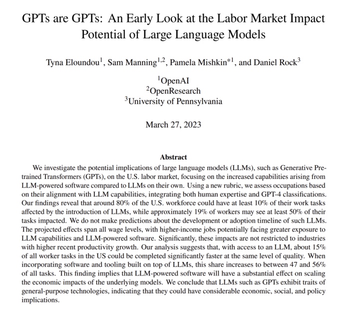
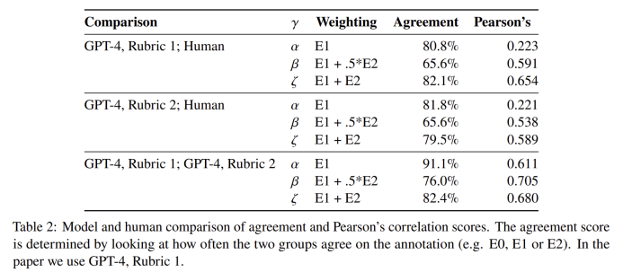
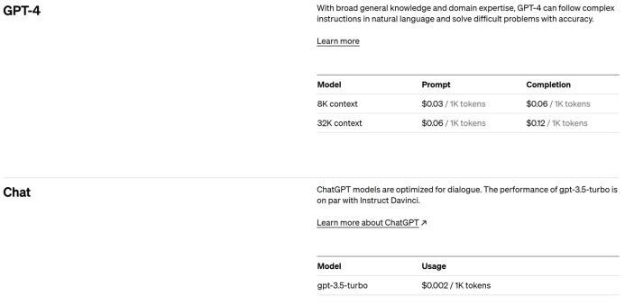
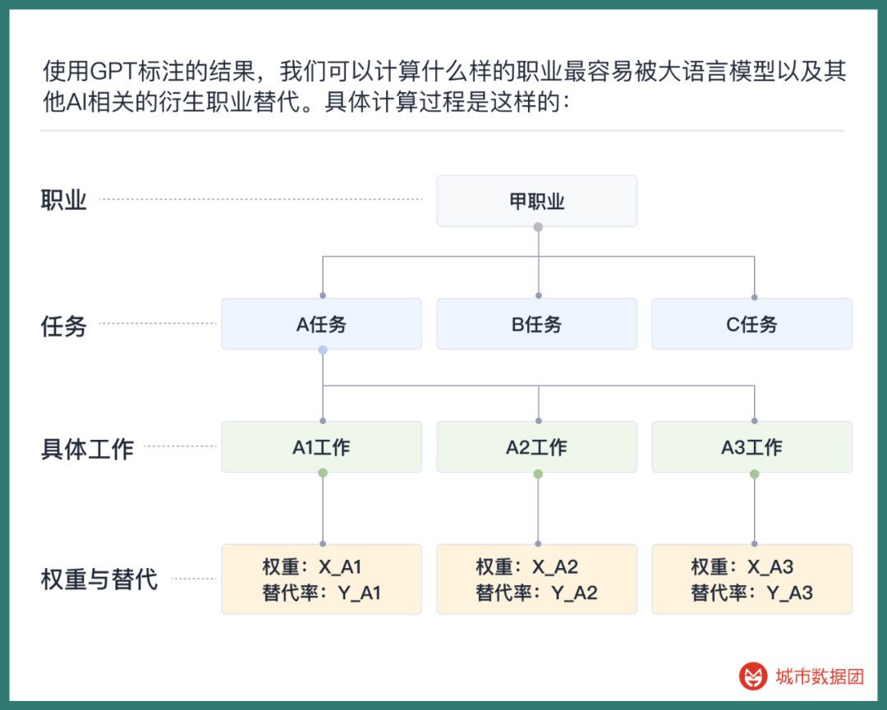
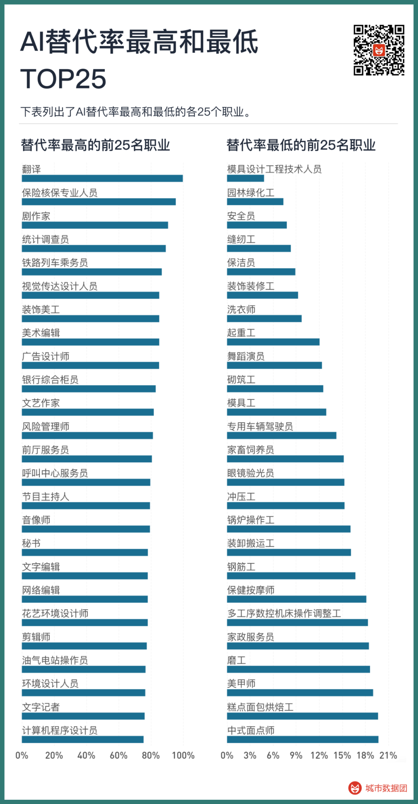
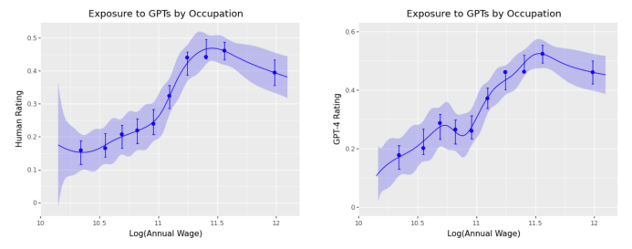
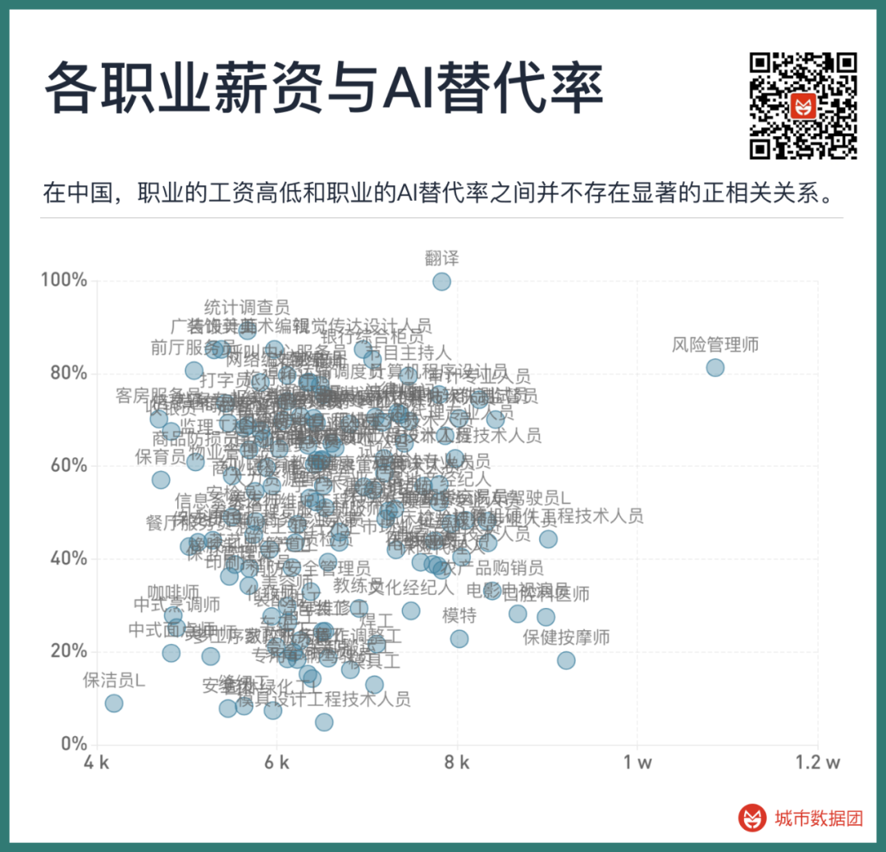
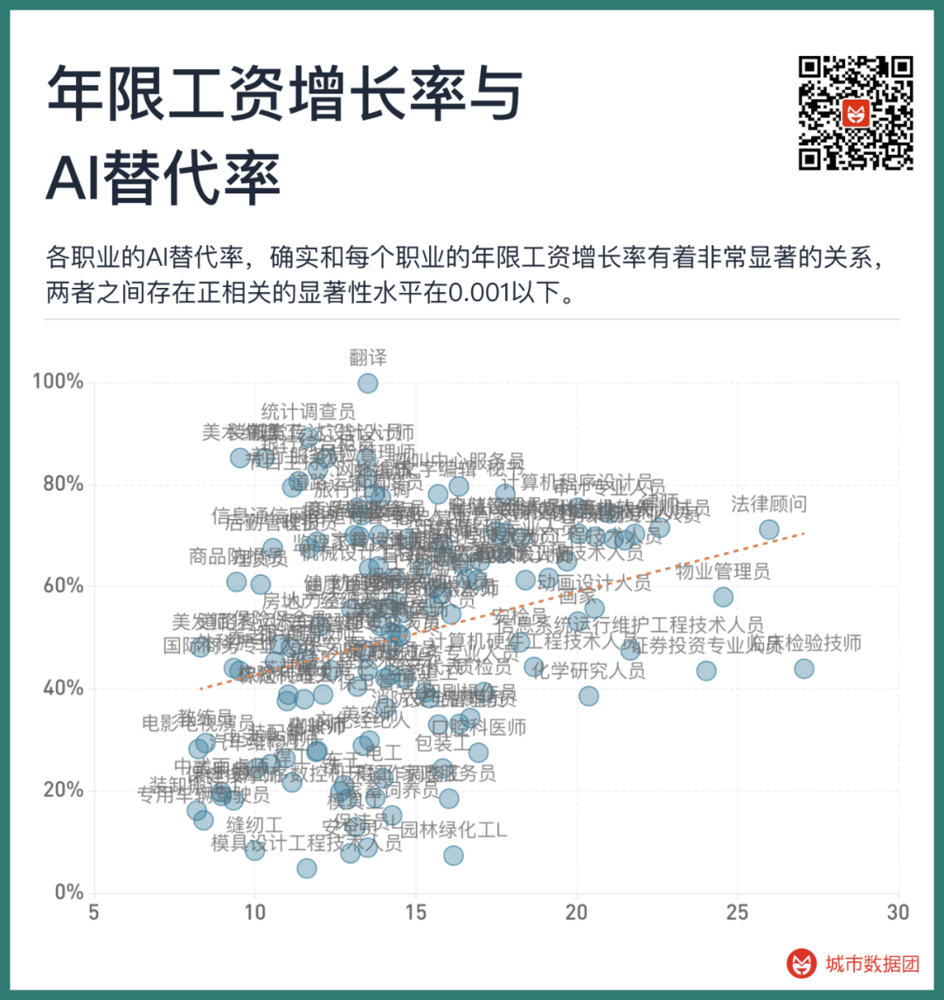
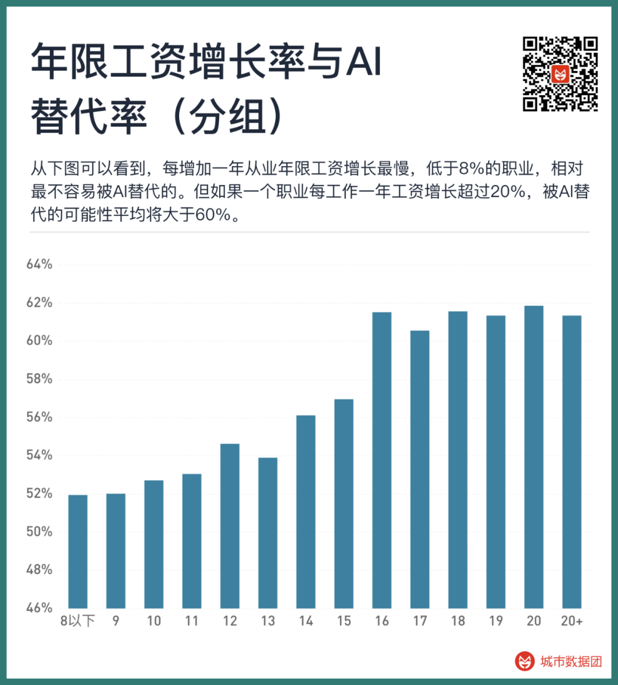

## GPT is here, will I be replaced by it?

Readers who have followed our previous two articles will find that the recruitment data we use is up to the end of 2022. 

But in 2023, it seems to have entered a new era, the rapid launch of various generative AI has brought unprecedented shocks. The most representative of generative AI is OpenAI's large language model - ChatGPT. Many people, through personal trials, feel a deep crisis while being shocked by technology, as if their work can be easily replaced by AI. This emotion was quickly captured by various media and marketing numbers, and was amplified to the point where everyone knows it through individual interviews and literary interpretations. However, so far, serious research on the impact of generative AI (or narrowly to large models) on the job market is still rare. 

The most meaningful research at present is actually from OpenAI itself. OpenAI in their latest working paper "GPTs are GPTs: An Early Look at the Labor Market Impact Potential of Large Language Models", discussed in depth the possible impact of AI on the labor market. 

In this article, researchers found that under the impact of the increasingly popular large language model (LLM), at least 80% of the US workforce will be affected, and 10% of their work will be replaced by LLM. Among them, 19% of the US workforce has more than 50% of the work to be replaced. 

Note that the above research is only limited to the US job market. So, what about China? This is a super-large but completely different labor market from the United States, and it is also facing population aging and various labor-capital contradictions; how many of the various positions in China will be replaced or even disappear due to the impact of large language models? 

In this article, we will use the ideas of OpenAI's working paper, use recruitment data from China, and use our independently designed methods to try to give a comprehensive data answer to this public concern that goes beyond emotional cognition and covers all occupations.

## Discussion on the key issue of AI substitution: What exactly is each profession doing?

To analyze to what extent a position can be replaced by GPT or other derived AI models, the first thing to clarify is a key issue: 

**What exactly is each profession doing?**

We often see in marketing numbers that AI will replace secretaries, AI will replace programmers, and so on. But this is a very vague expression. In essence, what AI replaces is not a vague professional name in public cognition, but the functions and work content contained in this profession. 

So, what are the functions contained in the profession? On the recruitment website, we will see "job description", for example, the job description of a typical human resources department employee may include the following content: 

1. Recruitment of new employees, handling of employee entry procedures 
2. Arrangement and implementation of new employee entry training 
3. Attendance and salary performance calculation 
4. Maintenance and expansion of the company's recruitment channels, assistance in social recruitment and other recruitment activities
5. ... 

Everyone can see that each of these is a function of the human resources department. And each function includes richer work content. For example, "arrange and carry out new employee entry training", which includes the following specific work content - 1, writing, preparing training materials; 2, communication, communication and arrangement of schedule; 3, speech, training, improve employee skills... and other specific work content. 

When the work structure of the "human resources specialist" profession is broken down into several or even dozens of functions and work content, it is only possible to judge how likely it is that the content of "writing, preparing training materials" will be impacted by AI, so as to produce specific, quantifiable, and meaningful answers. 

Well, then the question is, how can we get the function and work content information of each profession? In order to obtain the task decomposition information of various occupations, the Onet database is used in the OpenAI paper. Onet, the full name is Occupational Information Network, is a free online database based on standardized American occupations. This database has completed all (American) professional decompositions. 

So does China have a database like Onet? Unfortunately, there is currently no, and because there is a certain difference between China and the United States in the definition of occupations, the occupations in the Onet database are difficult to form an accurate mapping relationship with the standard occupations in the Chinese Occupational Dictionary. 

So we adopted an indirect matching method, using real recruitment data on the market as a medium, each piece of recruitment data, through the method in the previous article, simultaneously maps to the Chinese standard profession and the O\*net standard profession, and then summarizes according to the Chinese standard profession, thus obtaining the work tasks and specific work content under each Chinese standard profession. After summarizing and abstracting and merging, we matched and produced a total of 1639 occupations, 19265 functions and 23534 work content.

## Who will judge the AI substitution? Unexpectedly, the "data annotator"

After obtaining the above data, that is, clarifying the specific work tasks and content of each occupation, according to the method of OpenAI, the next step is to label each work task and specific work content to specifically judge whether it will be replaced by AI. At this point, the data to be labeled is about tens of thousands, so how to complete this work?

In the past, we needed to hire a large number of human data annotators to label the 19,265 work tasks and 23,534 types of work content, let the annotators judge the possibility of each task being replaced by AI, whether it is 30% or 70%, and then merge these annotators' work together to average, to get the possibility of each occupation being replaced by AI.

Data annotators are actually a very novel occupation. They first appeared in the 2022 edition of the "China Occupation Canon". The occupation code is 4-04-05-05-01. Under the category of "Artificial Intelligence Trainers", the main work content includes "Labeling and processing the original data of pictures, text, voice, etc.". Judging whether the specific tasks and work content of each occupation will be replaced by AI is naturally also a kind of work of data annotators.

Yes, it should have been done this way, and it has been done this way for so many years. But now we have a large language model, we have GPT, and things start to change. 

In the working paper of OpenAI, the author indeed hired humans to label these work contents, but they also invited another more efficient assistant, that is GPT itself. After using a complex prompt to make GPT understand the background of the labeling task, let GPT take action by itself and judge how much possibility each work content will be replaced by itself.

The result is somewhat unexpected, but it makes sense when you think about it-GPT's labeling results are highly consistent with human labeling results, and more than 81% of the labels are exactly the same. The paper let GPT annotate twice with different prompts, and the results are also very similar, with 91.1% of the results the same between the two annotations. The paper finally chose one of GPT's annotation results for research, and the human annotation results were only used to judge the rationality of GPT and were not used in the paper.

Yes, let GPT label the "possibility of a certain work content being replaced by GPT". Let magic judge magic. We naturally also used this method, directly used the API of GPT-4, and labeled each type of work content for each occupation. The specific prompt is similar to this (the prompt we finally used is not exactly the same, it can be modified according to the needs):

You are a "large language model labor substitution assessor". Large language models are deep learning models used to process and generate natural language text. The latest large language models can generate and describe the creation of images and videos based on natural language text. Against this background, you need to score each of the following tasks from the perspective of "whether the task can reduce human labor time participation under the premise of achieving the same output or the same effect with the help of a large language model". The score ranges from 0 to 5 points, 0 means that the task cannot reduce human labor input with the help of a large language model, 1 means that it can reduce 20% human labor input, 2 means it can reduce 40% human labor input, 3 means it can reduce 60% human labor input, 4 means it can reduce 80% human labor input, 5 means it can reduce 100% human labor input, that is, the task no longer needs human labor participation. Your score represents how much labor input the large language model can save in each task. Please score carefully based on the current progress of the large language model and what you think the future development situation may be. Please return the score result of each task in the format of "id, score" for each line.

In the API, the above content is used as the background input, and then the specific work tasks and work content can be input. Multiple entries can be input at a time, but due to the input token limit, we can input about 100 at most each time for GPT to help label. Next, the API of GPT-4 will quickly return the result. Since the tasks have been broken down in detail, the labeling of each task is very accurate and robust. What's more important is that using GPT to label, the cost is extremely low. To label 40,000 pieces of content, label 100 pieces each time, only 400 times are needed. Using the GPT-4 model, each time 100 pieces are labeled, it only costs $0.12. That is to say, a total of only $48 is needed, which is more than 300 yuan in RMB. If you use the gpt-3.5-tubo model that is not so accurate, but faster and cheaper, 40,000 pieces only need to consume $3, about 20 yuan. The performance of GPT-4 and gpt-3.5-turbo is almost no difference in such simple tasks. Human data annotators need at least 10,000 yuan to complete the annotation of 40,000 pieces of content, and a week. GPT only needs half an hour, the money for a cup of milk tea. And the results are very accurate and robust.

Next, the GPT-4 API will quickly return the results. Since the tasks have been broken down in detail, the labeling for each task is very accurate and robust.

More importantly, the cost of using GPT for labeling is incredibly low. To label 40,000 pieces of content, each time labeling 100 pieces, only requires 400 times. Using the GPT-4 model, each time 100 pieces are labeled, it only costs $0.12. That is to say, a total of only $48 is needed, which is a little over 300 yuan in RMB. If you use the less accurate but faster and cheaper gpt-3.5-turbo model, 40,000 pieces only need to cost $3, about 20 yuan. On such simple tasks, the performance of GPT-4 and gpt-3.5-turbo is almost indistinguishable.

A human data labeler would need at least 10,000 yuan and a week to complete the labeling of 40,000 pieces of content. GPT only needs half an hour and the cost of a cup of milk tea. And the quality of the two is almost the same.

We must face an ironic fact -

The newly emerged profession of human labelers, who have only been around for a few years, are being replaced by the large language model GPT that they fed and trained. When completing a task of "which occupations can GPT replace", the first to be replaced were the human data labelers who trained GPT.

## Through the results of "work content labeling", we found the occupations most easily replaced by AI

Using the results of GPT labeling, we can calculate which occupations are most easily replaced by large language models and other AI-related derivative occupations. The specific calculation process is as follows:

All the work weights (from O\*net data) and substitution rates are multiplied and then summed to get the AI substitution rate of the profession, which can be understood as how much of the work content of this job can be replaced by AI. We have summarized all the labeling results on Chinese occupations and given the "AI substitution coefficient" of each profession in the Data Group+ applet (thanks to Yang Yang from the University of California, San Diego (UCSD) for providing relevant data and calculations).

The table below lists the 25 occupations with the highest and lowest AI substitution rates among the occupations that have reached a certain scale of recruitment.

The profession with the highest AI substitution rate is translation, followed by insurance underwriting professionals and playwrights. These three occupations have over 90% of their work tasks and content exposed to the risk of AI substitution.

Next, visual communication designers, decorative artists, art editors, advertising designers, editors, these occupations related to art, video, drawing, are also over 80% replaced by AI in terms of work content. Text editors, web editors, literary writers, text journalists, these occupations highly related to text generation and modification, the content replaced is also over 75%.

Call center service personnel, front desk service personnel (i.e., personnel providing consultation, reception, check-in registration, checkout and other front desk services for guests), program hosts, secretaries... these occupations also appear in the top 25.

Of course, we cannot forget the 25th ranked computer program designer, on average, programmers have 75% of their work content facing the risk of being replaced by AI.

The occupations with the lowest AI substitution rates are mainly various manufacturing-related blue-collar workers. This is not surprising, because when we let GPT play the role of "large language model replacement labor evaluator" in scoring and labeling, it naturally cannot evaluate the occupations that may be replaced by other machines. But there are still a few people outside of manufacturing workers worth noting - landscapers, cleaners, laundry masters, masseurs, manicurists, Chinese pastry chefs... these occupations that don't seem to require too high education and don't have the highest wages, have become the hardest occupations to be replaced by AI.

Of course, the above are just some summaries, if you are interested in more information about the AI substitution risk of more occupations, you can query and explore in the Data Group applet.

## Exploration behind AI substitution rate and professional characteristics

In the work paper of OpenAI, researchers found a stable positive correlation - the higher the wage of the profession, the higher the possibility of being replaced by GPTs. This trend only reverses after the annual income of the profession exceeds $100,000, as shown in the figure below.

So what about China? Please see the figure below

As you can see, the phenomenon in the United States does not seem to appear in China. There is no significant positive correlation between the wage level of the profession and the AI substitution rate of the profession.

However, as mentioned in the previous article, for each profession, the current wage is only part of the content, what's more important is the growth rate of years in the profession. Some jobs may have lower entry wages, but they have more room for growth as the years of work increase, resulting in higher total income over ten years.

So, what is the relationship between the wage growth rate of years in the profession and the AI substitution rate of each profession? See the figure below:

As you can see, the AI substitution rate of each profession does have a very significant relationship with the wage growth rate of each profession's years, the significance level of the positive correlation is below 0.001. If we change the above figure into a segmented bar chart, we will see a more obvious trend. Please see the figure below:

As you can see from the above figure, the occupations with the slowest wage growth per year of employment, less than 8%, are relatively the least likely to be replaced by AI. But if a profession's wage grows by more than 20% for each year of work, the likelihood of being replaced by AI averages over 60%.

This trend indicates a significant feature of the large language model and its related AI in this round, that is:

The experience, skills, and tips that people accumulate in an industry, on the one hand, make these occupations seem to have stronger "growth", but on the other hand, they are the first things to be replaced by large language models.

On the contrary, those human abilities that do not require deep learning to master have become skills that will not be replaced by AI.

## Why is AI replacing these? Why are we us?

Among the various jobs that are replaced by AI, why are they the ones mentioned above?

The first possibility is that those occupations that can accumulate more experience and improve productivity faster after learning and working, have higher labor costs themselves, so people are more motivated to find AI that can replace this kind of labor, and give more investment to such AI products, so these occupations become the first batch of sacrifices.

This makes some sense, but we can also find many counterexamples, such as autonomous driving. Driving this skill, people can master it in a few hours or at most a dozen hours; on the other hand, investment in autonomous driving is one of the top in the field, but the current effect is still a long way from full-condition autonomous driving.

On the contrary, some biological and chemical skills, compound finding, protein folding, or full automation in experimental procedures, these knowledge that people need years of professional training to master, although the capital intervention can only be a drop in the bucket compared to autonomous driving, but there are already very good replacement AI.

From this point of view, the logic of higher labor prices - attracting more investment - more likely to appear replacement AI seems not entirely correct.

So, we have to consider the second possibility - the skills that humans learn knowledge, accumulate experience and tips through practice, AI has indeed achieved or even surpassed.

Yes, it's not a single skill, nor a group of skills, but those skills that are acquired through hard learning and practice, humans are already behind AI. Those high-growth occupations, whether they are in the safe zone now or not, the appearance of replacement AI may be a matter of these few years, or even a few months.

In the end, those skills that human children have mastered even at birth, those exquisite biological instincts of humans, seem to be the hardest part for AI to imitate and replace.

And those acquired knowledge, it takes a long time to learn arithmetic, learn to write, learn to draw, learn to program, learn to make good-looking ppt, learn to read X-ray films, learn to write legal documents, learn many languages and communicate freely... Humans have learned all kinds of things to be proud of, and feel that these characteristics seem to make humans philosophically different from other creatures.

But in the eyes of AI, these things are worthless.
