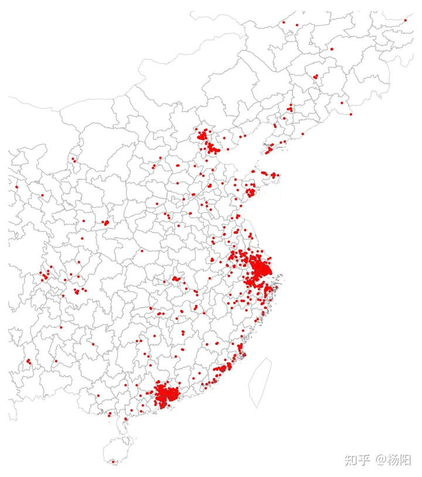
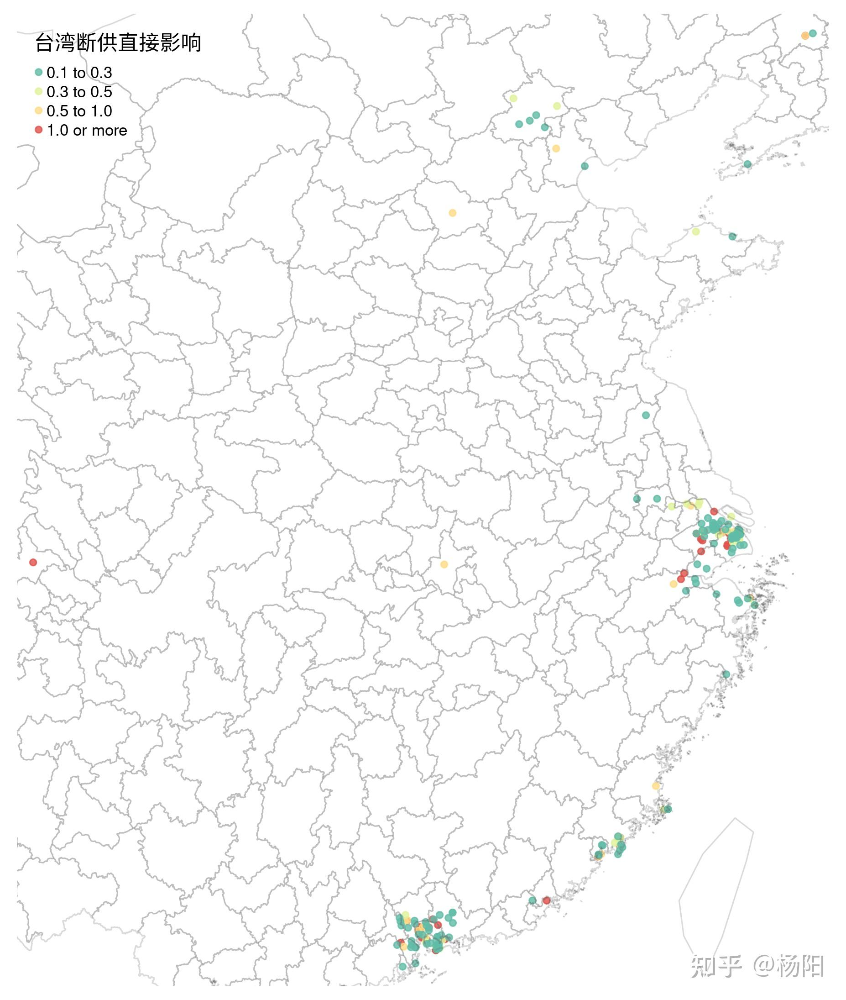

The complete and diversified supply chain has become increasingly important in the international situation in recent years. The trade war between China and the United States has lasted for nearly 2 years. Although there are signs of easing now (?), the confrontation between China and the United States in other aspects will only increase, not decrease. The most intense place of confrontation between China and the United States, and the direction that is most likely to bring uncertainty in the future, is naturally the southeast of the mainland. Don't say that you didn't predict it, prepare for the rain first. If the war in the southeast unfortunately breaks out, the industrial chain of mainland China will naturally be affected, especially the potential damage caused by the war and the obstruction of transportation, which will cause major impacts on enterprises that rely on the industrial chain of Taiwan. This article uses the monthly product import data of China's imports and exports to Taiwan to analyze the scale and scope of this possible impact, and provide a possible pre-plan for mainland enterprises to prepare in advance.

## Import Dependence on Taiwan Products

First, we look at which products in the mainland area have a higher dependence on Taiwan. According to the quantity of goods imported from all over the world in China in the past five years, I calculated the proportion of Taiwan products. The top 10 products are as follows:

| HS8 Product Code | HS8 Product Name | Import Taiwan Product Proportion |
| --- | --- | --- |
| 01069011 | Tadpoles and froglets for pure breeding | 100% |
| 03028200 | Fresh or frozen rays | 100% |
| 03028500 | Fresh or ice fresh bass | 100% |
| 03034900 | Frozen tuna | 100% |
| 03062110 | Cultivated lobsters and crayfish | 100% |
| 03062210 | Cultivated lobsters | 100% |
| 03062910 | Other cultivated edible crustaceans | 100% |
| 03063110 | Cultivated live spiny lobsters and other sea lobsters | 100% |
| 03063210 | Cultivated live lobsters | 100% |
| 03063391 | Live/fresh/ice fresh freshwater crabs, non-breeding | 100% |

The products with an import proportion of 100% from Taiwan are concentrated on the procurement of Taiwan's agricultural products. Due to the mainland's Taiwan policy, such results should not be surprising. Although the import proportion of these products in Taiwan is high, from another perspective, these products can be self-sufficient in the mainland, but they choose to purchase from Taiwan for policy reasons. These policy-oriented import purchases, especially the purchase of agricultural products, have very strong substitutability: just don't eat tuna and crayfish for a while. Therefore, when analyzing the import proportion, we should ignore categories such as agricultural products and aquatic products, and focus on industrial raw materials, intermediate products, and finished products. These products are the imported products that may cause shocks to the supply chain.

Therefore, we remove all agricultural and pastoral products, toys, jewelry and other final consumer goods, and only consider 42 major categories of products including chemicals, electrical equipment, machines, and measurement and inspection instruments. Among these 36 major categories, there are 220 sub-categories of products, and the proportion of products imported from Taiwan in the mainland area exceeds 50%. Among them, the proportion of imported Taiwan products reached 100%:

| HS8 Product Code | HS8 Product Name | Import Taiwan Product Proportion |
| --- | --- | --- |
| 29071310 | Nonylphenol | 100% |
| 29394400 | Ephedrine and its salts | 100% |
| 30032015 | Neither standard dose nor retail packaged cefaclor drugs | 100% |
| 30042011 | Cefixime drugs in dosage or retail packaging | 100% |
| 37024100 | Color film, unexposed, unperforated, width >610mm, length >200m | 100% |
| 85211019 | Other tape recorders | 100% |
| 84261943 | Well frame unloading bridge | 100% |
| 84451329 | Other cotton yarn roving machines | 100% |
| 84619011 | Double column (open) planer | 100% |
| 84631019 | Cold drawn tube rack, drawing force 300t | 100% |

Nonylphenol, which has an import ratio of 100%, is an important fine chemical raw material and intermediate. It is mainly used to produce surfactants, antioxidants, textile dyeing and finishing aids, lubricant additives, pesticide emulsifiers, resin modifiers, resin and rubber stabilizers and other fields. However, interestingly, since 2007, the Ministry of Commerce has initiated anti-dumping investigations on nonylphenol originating in Taiwan and imposed anti-dumping taxes ranging from 6% to 20%. However, as of 2019, the import of nonylphenol still highly depends on Taiwan.

So, next we need to analyze, these 220 sub-categories of products, once the war is cut off, whether our country is easy to get substitutes from other countries on the supply chain? Here we use an index that describes the degree of concentration, the Herfindahl index (HHI), to represent the dispersion of the source of a certain type of product imported by our country. Theoretically, the more suppliers on the supply chain and the more diversified the procurement, the higher the security of the supply chain.

## Diversity of the source of high import ratio products

We calculate the diversity of the source of a certain product through the following formula. If all the import volume of a product comes from the same country or region, then the diversity of the source is equal to 1; if 2 units are imported, they come from two countries, then the diversity of the source is equal to 0.5.

Diversity of a certain imported product $$source = 1-\sum^{220}_i(\frac{Import\ volume_i}{Total\ import\ volume})^2$$

Among the 220 sub-categories, we use the diversity index less than 0.5 as the judgment standard, and screen out 81 kinds of products with high import ratio and the source is dominated by Taiwanese products. These products can be divided into the following categories:

Category | Product
--- | ---
Chemical raw materials | Nonylphenol, other tungsten oxides and hydroxides, other glass fiber woven fabrics, lithium ferrophosphate, dioctyl phthalate, vinyl acetate, potassium alum, tetrahydrophthalic anhydride, polytetramethylene ether glycol, butanone, sodium silicate, stainless steel ingots, chlorides, refined copper foil, etc.
Pharmaceutical raw materials | Ephedrine and its salts, Chinese medicine wine, cefotaxime drugs, etc.
Production machinery | Double column (open) planer, hot rolling tube machine, other cotton yarn roving machines, socket wrench, non-domestic automatic interlocking machine, high-precision grinding machine, rotary pneumatic hand tools, CNC drilling machine, horizontal lathe, punching machine, blowtorch, CNC grinding machine, etc.
Industrial textiles | Rubber textile fabrics, other synthetic fiber woven fabrics, polyamide deformed yarn, glass fiber strips, high-strength nylon, unbleached or bleached synthetic fiber woven fabrics, other glass fiber woven fabrics, etc.

These products involve the supply of raw materials and important production tools for manufacturing, and will have a significant impact on the chemical, textile, pharmaceutical, and metalworking industries. Especially for raw material supply, once it is cut off, it may immediately cause a shock to the industrial chain. And these industries are the upstream industries of many final consumer goods. If they do not respond well, the impact may spread to downstream industries. But if the Southeast war does not last long and the scale is controllable, then the import of production machinery may be able to resume after a brief pause, which is relatively acceptable to the impact on the industrial chain.

However, if the war is undecided, or if local enterprises cannot resume production as soon as possible after the war, then a dilemma needs to be faced: on the one hand, the supply of Taiwan's local products has problems, on the other hand, the United States and its allies are very likely to impose sanctions on China, including trade embargoes. Therefore, considering the possible embargo, we need to exclude the "close" allies of the United States and recalculate the diversity of the source of imported products. After we remove the Five Eyes Alliance members the United States, Japan, Australia, New Zealand, the United Kingdom, and Canada, the products that may cause impact increase from 81 to 114. The newly added products are as follows:

Category | Product
--- | ---
Chemical raw materials | Carbon dioxide, ammonia water, tetrahydrofuran, other amino resins in primary shapes, 6mm refined copper wire, refined copper clad copper plate for printed circuits, forged magnesium, manganese dioxide primary batteries
Production machinery | Anti-corrosion board for circuit processing, gear winches, flat screen printing machines, other lathes for removing metal, knee-type milling machines, thread tapping machines, high-precision CNC surface grinders, thread rolling machines, plastic bridge molding machines, looms with a width of 30 cm
Industrial textiles | Containing 85% synthetic short fibers, other fabrics made of metal wire/metal yarn containing man-made fibers, other textiles treated with polyurethane

## Possible Impact on China's Industries

From the perspective of decision-makers, we should also consider how the affected supply chain will impact China's macroeconomy and whether this impact can be tolerated. Based on China's enterprise-level customs import data in 2016, we can estimate the scale of companies directly affected by these products and the potential economic impact.

In 2016, a total of 2,451 enterprises imported these 81 highly dependent products from the "Taiwan-Penghu-Kinmen Customs Zone" with a total value exceeding 1.9 billion yuan. We obtained relevant information about these companies from the industrial and commercial registration database.

According to the registered addresses of these companies, their geographical distribution is shown in the following figure:

It can be seen that China's Pearl River Delta, Yangtze River Delta, and the economic belt around Beijing have a large number of companies highly dependent on imported products from Taiwan. The distribution of these 2,451 companies roughly corresponds to the geographic distribution of China's manufacturing industry.

Due to differences in company size, these companies have varying levels of risk tolerance in the face of the disruption of Taiwan products. We made a simple calculation based on the registered capital and import quota in 2016. Assuming that these 81 Taiwan products have no substitutes and using the value of the final products of these companies as an estimate (which is actually a significant underestimate), we can define the risk faced by companies as:

$$Risk = \frac{Value\ of\ Products\ Directly\ Affected\ by\ Taiwan\ Disruption}{Registered\ Capital}$$

In the following chart, we plot the companies for which the direct impact of Taiwan's disruption exceeds 10% of their registered capital. Both in terms of quantity and degree of impact, the direct impact is quite limited.

Considering that some companies mainly engage in commercial trade, import and export, and warehousing logistics, the products they import are not used as intermediate goods in their own production but are directly sold. Therefore, when considering the direct impact of disruption, we exclude these companies. For the remaining companies, we provide the following warning list based on the degree of impact. These companies imported a significant value of highly dependent goods from Taiwan in 2016. If there are events in the Southeast, they may be directly affected.

Company Name | Direct Impact Index of Taiwan Disruption
--- | ---
Stanley (Zhongshan) Tools Co., Ltd. | 0.6905926
Dongguan Anda Supply Chain Co., Ltd. | 0.5663260
Foshan Shenyuan Electronic Materials Co., Ltd. | 0.2887774
Junzhuo Electronics (Zhongshan) Co., Ltd. | 0.2819164
Suzhou Dawei Precision Industry Co., Ltd. | 0.2776237
Xiamen Tuofu Pearl Jewelry Clothing Co., Ltd. | 0.2549209
Zhuhai Yingchen Webbing Co., Ltd. | 0.1821954
Huizhou Feibo Sports Equipment Co., Ltd. | 0.1480040
Dongguan Lianmao Electronic Technology Co., Ltd. | 0.1422973
Huizhou Maoda Sewing Products Co., Ltd. | 0.1357252

Disclaimer: This article provides a shallow analysis of the direct impact of events in the Southeast on mainland Chinese companies based on publicly available data. The purpose is to provide a data-based perspective and does not constitute any policy recommendations.

